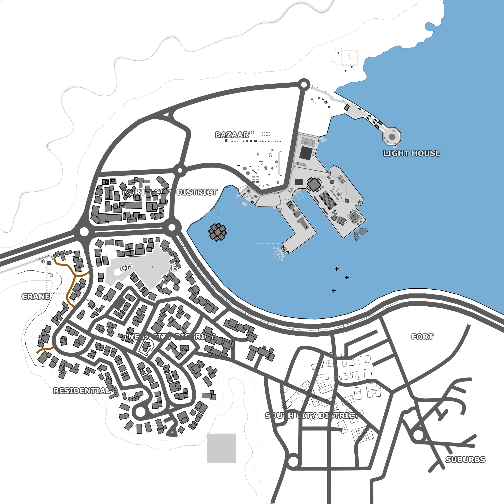

# Running with Rifles map18 'Muttrah District'

## Project Kanban

[muttrah map](https://github.com/orgs/rwr-community-dev/projects/2)

## Discord Channel

[map18-community-project](https://discordapp.com/channels/181119538664964097/727420877141966899/) @ [RWR DISCORD](https://discord.gg/runningwithrifles)

## About

A community-driven project involving multiple modders from the RWR community. Each contributor has created a portion of the larger map (see [Work Sectors](#work-sectors)).


## Usage

To test the map:

1. Change into your \<RWR install directory\>/media/packages/ and clone this repository.
    * ```git clone https://github.com/rwr-community-dev/_muttrah_map_project.git```
    * Alternatively, download this repository as a zip archive and extract into the folder.
1. Start RWR and launch a quickmatch using map *Muttrah District* or directly from the command line (examples below)
    * PC: ```<RWR_install_folder>\rwr_game.exe no_ai debugmode verbose map=media\packages\_muttrah_map_project\maps\map18```
    * MAC: ```/Users/<username>/Library/Application\ Support/Steam/SteamApps/common/RunningWithRifles/RunningWithRifles.app/Contents/MacOS/RunningWithRifles debugmode verbose map=media/packages/_muttrah_map_project/maps/map18```
    * Cross-platform (if python>=3.6): run `quickstart.py` from the root of the local repo directory tree

## Work Sectors

Note: *Sector names are subject to change, whilst work is ongoing, pending suggestions from the sector contributors*

| Sector Name | Contributor |
| ----------- | ----------- |
| FORT | [ComradeCheekiBreeki](https://github.com/ComradeCheekiBreeki) |
| SUBURBS | [Robert Augustus](https://github.com/RobertAugustus) |
| WALL | [Robert Augustus](https://github.com/RobertAugustus) |
| SOUTH EAST CITY DISTRICT | [Robert Augustus](https://github.com/RobertAugustus) |
| MOSQUE | *pending* |
| BASTION | *pending* |
| WEST CITY DISTRICT | *pending* |
| RESIDENTIAL | *pending* |
| CRANE | [anoshi](https://github.com/anoshi) |
| CENTRAL CITY SQUARE | *pending* |
| NORTH CITY DISTRICT | *pending* |
| NORTH WEST CITY DISTRICT | *pending* |
| BAZAAR | GarandalaHS |
| DOCKS | [david-wm-sanders <MR. BANG>](https://github.com/david-wm-sanders) |
| LIGHT HOUSE | GarandalaHS |
| (SOUTHERN INSURGENT CAMPS) | *pending* |
| (NORTHERN INSURGENT CAMPS) | *pending* |
